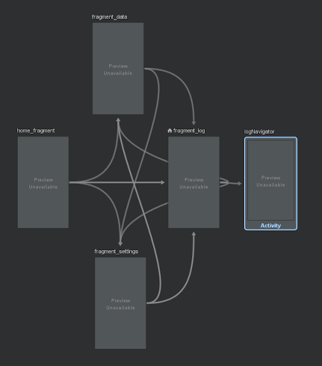

Eco-friendly was my senior Computer Science thesis. Me and a classmate designed and developed an activity logger that would compute the users Carbon and Water footprint. This information was all stored in the cloud using Google's Firebase database system.

The metric's we chose to evaluate fell into three main categories. Travel, waste, and consumption. Within these categories we had a few presets.

<!-- 
1. Travel

    * Car

    * Bus

    * Plane

    * On Foot

2. Consumption

    * Poultry

    * Steak

    * Pork

3. Waste 
    * Single-use plastics
    * Items Recycled
    * Trash bags produced -->

<!-- </img> -->
<!-- 

 -->
<!--  -->
<!--  -->

Transportation                                                      |    |  Consumption                                                       |    | Waste
:------------------------------------------------------------------:|:----------:|:------------------------------------------------------------------:|:----------:|:------------------------------------------------------------------:
 |    |                           |    |  
<!--  |    |                           |    |   -->

<!-- </img> -->

**Fragment Navigation**

\------------------------------------------------------------------------------------------------------------------------------------------------------------------------------------

**Eco Friendly**
Created by Jakob M Paulson-Palmer & Daniela Camacho

🌲🐻

Background and Introduction

The Intergovernmental Panel for Climate Change (IPCC) believes that by the end of the century our planet will warm by 2°C as a result of global warming (Archer et al., 2019, p.1). Global warming is caused by a greenhouse effect when gasses such as carbon dioxide, nitrous oxide and methane are trapped in the atmosphere. Carbon dioxide is produced as living creatures breathe. Nitrous oxide is found in many fertilizers as well as animal excrement. Finally, methane is produced naturally in wetlands, and as a result of humans from rice paddies, gas drilling, coal mining, and manure. These gasses absorb energy from heat in the atmosphere and radiate this energy in the lower bounds of our atmosphere making it warmer (Brown & Leonard, 2015). This creates potential risk for many animals and ecosystems alike, the disruption of which would have many correlated negative impacts. Archer et al. (2019) make the following claim “Such increases in extreme temperatures are likely to have a negative impact on public health all along the mid-Atlantic, as high temperatures are associated with increased mortality.'' It is imperative that these damaging practices be evaluated and changed as necessary.

One approach at trying to aid the climate change issue is to look at environmentally harmful behaviors of people, and how to influence individuals to change them. Researchers created the term Behavioral Change Techniques, or BCT. In their paper GarnettCrane West Brown and Michie define BCTs with the following, “BCTs are defined as the smallest, observable, replicable components with the potential to bring about change in behavior” (Garnett et al., 2015, p.2). These BCTs are tools used to achieve behavioral change and can be used to resolve design strategies in hopes of better accomplish this goal.

Arguably one of society’s most pressing concerns it that of the environment; it is at the brink of collapse. Humans have been great contributors to this reality, as many lead lives where the environment is disregarded. It is necessary for individuals to change environmentally harmful habits in favor of a more sustainable lifestyle. To do so it is relevant to further explore Behavioral Change Techniques (BCT), and how to utilize them to foster a sustainable mindset. This paper will investigate human activities that harm the ecosystem, and how to better use technology to influence sustainable behavior by the means of BCTs.
