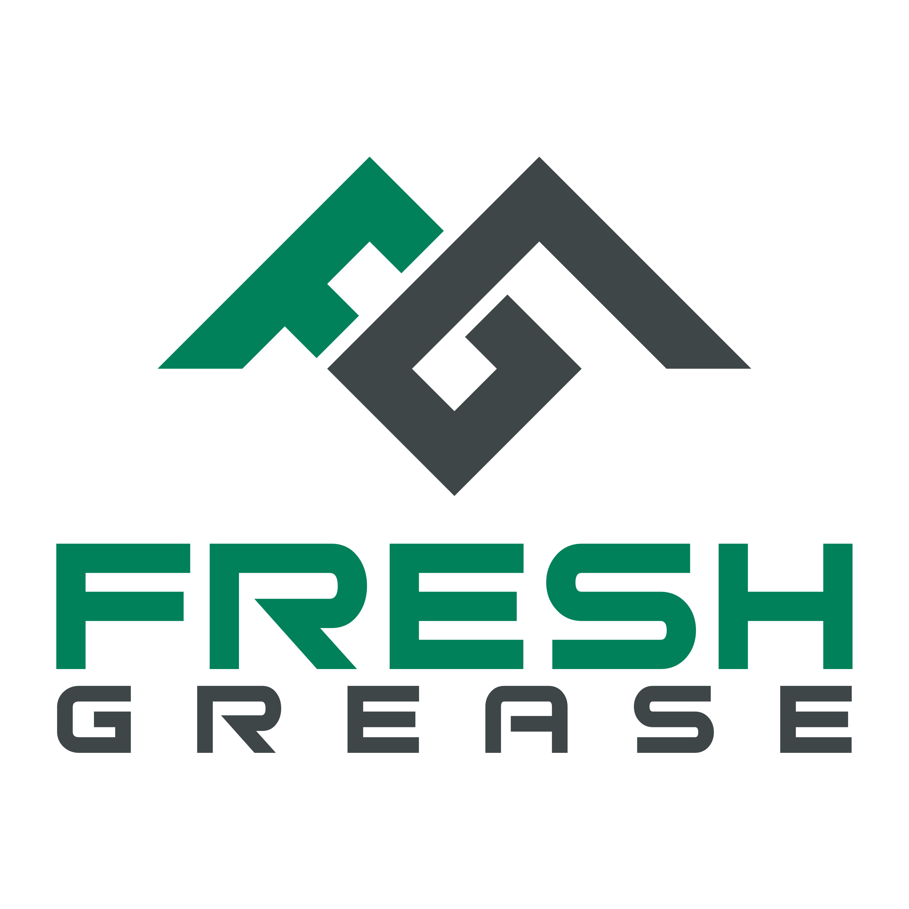

<li>Developed and deployed a functional progressive webapp using the MERN stack and Heroku.</li>

<li>Leveraged the Mongo Database, Mongoose and GraphQL to deliver a scalable backend designed to support user-login and complex object types for further computation.</li>

<li>Implemented popular API’s including e-commerce and content management solutions.</li>

<li>Used Docker and Github to maintain a stable containerized dev environment.</li>

