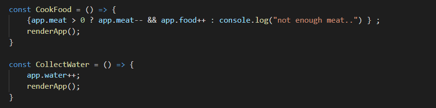
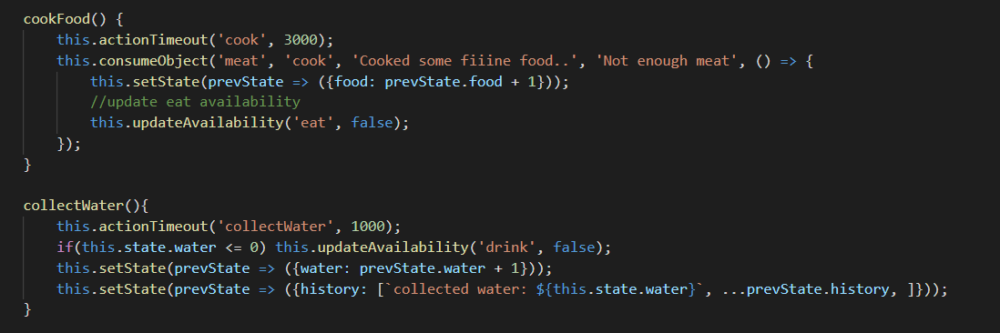

While completing Andrew Meads Udemy course on React fundamentals, I began working on A Lonely Bonfire as a project to exercise. I recalled playing <a href="https://en.wikipedia.org/wiki/A_Dark_Room">A Dark Room</a> (Michael Townsend) when I was younger and thought the gameplay would be a fun way to test this skillset on.

 **A Dark Room** 
A Dark Room begins with the player waking up in front of a dying fire. The player is able to collect and spend resources through the UI. At the start of the game you are limited to stoking the fire and shortly after gathering food and 

The text area is incredibly important to the story

Finally, there are further Adventure and RPG components. Including random encounters, and eventually some further complexities that I wont spoil now. If you havent played it before <a href="https://adarkroom.doublespeakgames.com/">you can check it out here!</a>

 

 **Design** 

Following some form of object oriented programming and the above mentioned course, I managed to get basic funtionality for a beginning few resources. Namely, Food water and wood. This allowed the player to begin the game, stoke the fire and stockpile a bit of food and water. 

However, before too long I happened upon State components. This allowed for an asynchronous alternative to props that came with more a couple benifits. For one, this worked in much more logically when I would later integrate a time lock and further restriction on button presses.

For example,

Soon became..

 **Further Extension** 
Looking to future iterations and additions I would like to explore using react hooks instead of its current state based system.