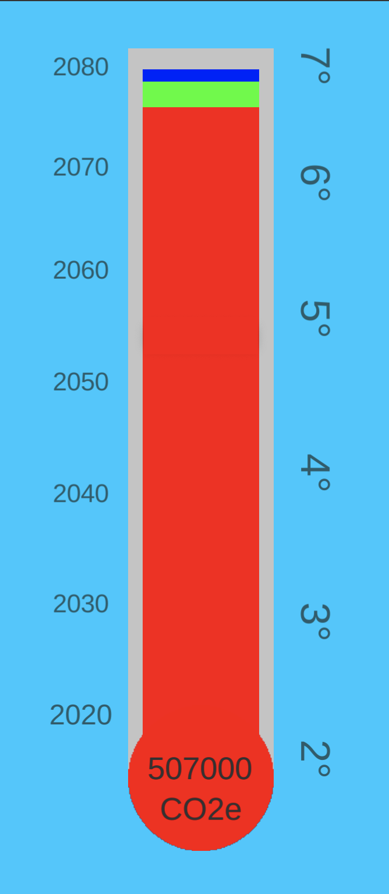

The Humboldt Environmental Game is created using Unity and written in C#. The goal of the game is to start discussions on how to best improve the environment, while showing the players the gravity of their impact on Greenhouse Gas(GHG) reduction.

To do this, each card is sized approximately in relation to its impact on GHG production/reduction. The players must spend the card in questions price in order to play any card on the board. The players all share a bank, starting at $10 million, and can be increased with certain cards savings.

<!--  -->

**Greenhouse Gasses**

**Gameplay**  
At the start of each game the number of players is decided. After entering in each players name, the blue and green cards are dealt. Players go around presenting their cards and what they suggest they should play. Cards cost money and all currency is shared among the players.

**Solution Cards** 
There are four kinds of solution cards. Blue, Green, Orange and Pink. Blue and green cards are dealt first and hold a range of different approaches to impacting GHG production. However, some of these cards require energy. At the start of the game the players have yet to generate any kind of clean energy, and thus are unable to play these cards until later. Orange and Pink cards hold different approaches to generate electricity, both giving clean energy as well as impacting the total CO2e.

**Design**
