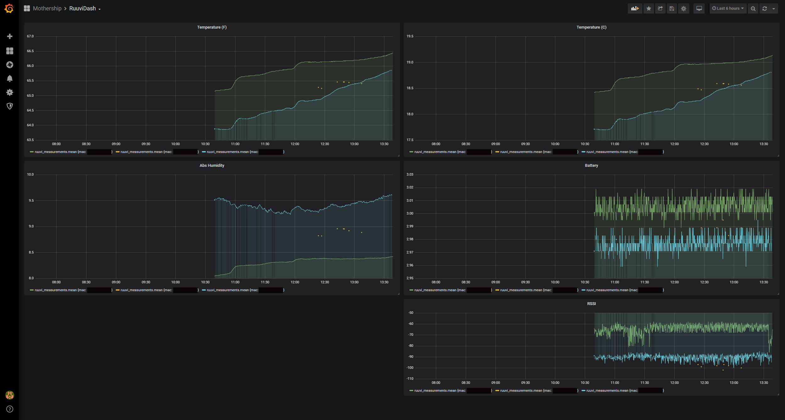
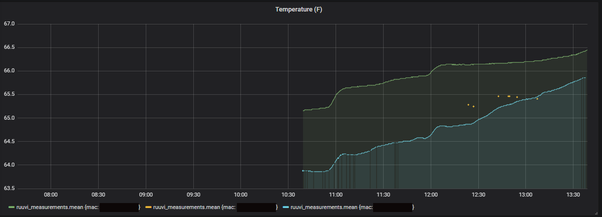
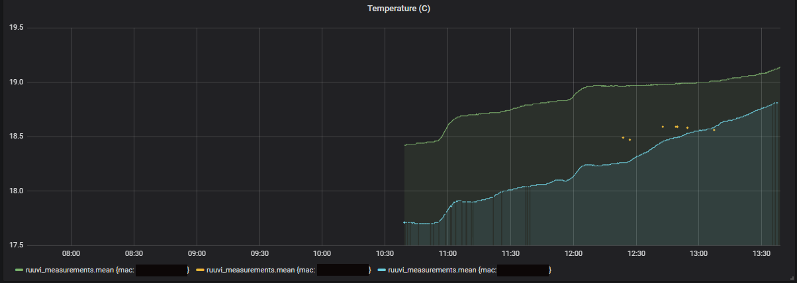
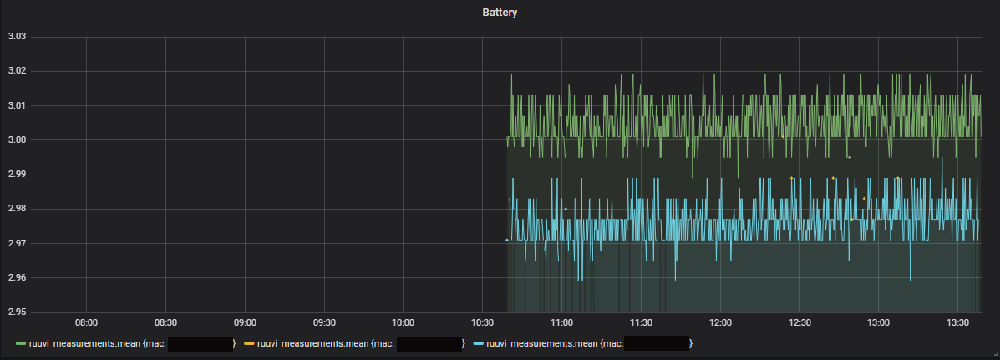
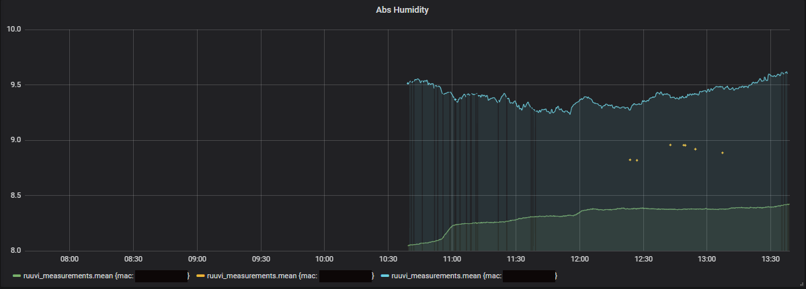

<link href="C:\Users\Monolith\Documents\programming\webdev\Gatsby-Portfolio\src\components\layout.scss" rel="stylesheet"></link>

For a while now I have been puzzled by my houses ability to have an entirely different temperature depending on the room. After programming for a few hours in my office, I would walk to the kitchen only to be hit by a wave of heat or cold in entirely unpredictable ways. I had also been interested in time-series database's, therefore logging the temperature seemed like a fun way to explore this kind of project, and gain a little insight into my local temperature patterns.

This project is a fairly basic Grafana dashboard, connected to an Influx database recieving information from a collection of Ruuvi tags placed around my house. <a href="https://ruuvi.com/">Ruuvi tags</a> are wonderful little open-source sensors that are capable of capturing temperature, humidity, air pressure as well as the specific devices signal strength(RSSI) and battery levels. Each device has a 1000mAH CR2477 battery that is easily replacable and lasts around a year.

 

Below is an example of my dashboard starting out. 

<!-- </img> -->
 
<!--  -->

<!--  -->

Battery (Mwh)                                                      |    |  Absolute Humidity                                                       |    | Temperature (F)
:------------------------------------------------------------------:|:----------:|:------------------------------------------------------------------:|:----------:|:------------------------------------------------------------------:
 |    |                       |    |  

 
This project also introduced me to using BLE protocols to connect the Raspberry Pi to each sensor.

 <!--  -->